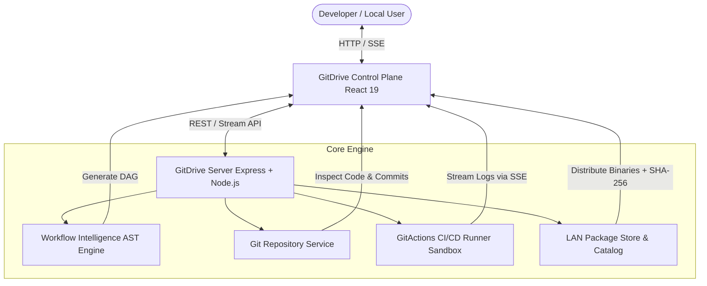

# GitDrive — Local-First Software Delivery Platform

[](LICENSE)
[](https://www.typescriptlang.org/)
[](https://react.dev/)
[](https://vitejs.dev/)
[](https://expressjs.com/)
[](#-air-gap-security--runner-fleet)

> **GitDrive** is a local-first software compilation, automated workflow inference, and private LAN distribution platform. Designed for privacy-critical environments, edge offices, and air-gapped networks where source code and builds must never leave the internal network.

---

## ⚡ Key Capabilities

### 1. 📂 Local-First Git Hosting & 2-Pane Code Explorer
- Native repository hosting and tree browsing with instant local clone URLs (`http://gitdrive.local/repos/<id>.git`).
- **2-Pane Code Explorer**: Left-hand file hierarchy with file size badges + full-height code viewer featuring line number gutters, syntax contrast, and 1-click clipboard copy.
- **Commit Timeline & Visual Diff Viewer**: Track commit hashes, authorship, and line-by-line additions (`+`) / deletions (`-`) for working tree changes.

### 2. 🧠 Workflow Intelligence (AST DAG Inference Engine)
- Zero-configuration pipeline generation: statically inspects workspace manifests (`package.json`, `Cargo.toml`, `*.csproj`, `go.mod`, `pom.xml`).
- Compiles project requirements into a deterministic Directed Acyclic Graph (DAG) spanning **Build**, **Test**, and **Package** stages.
- Grounding citations linking each stage to its exact source file trigger with full override flexibility.

### 3. 🚀 GitActions CI/CD Sandbox & Live Log Streamer
- Real-time build execution streamed to the browser via **Server-Sent Events (SSE)**.
- Isolated process execution sandbox with ANSI terminal rendering, line search filtering, and auto-scroll locking.
- Generates verified release bundles with cryptographic SHA-256 checksums and duration telemetry.

### 4. 📦 LAN Application Store & Distribution Cards
- Private enterprise catalog distributing compiled binaries (`.exe`, `.msi`, `.tar.gz`, `.zip`, Daemons) to local LAN machines.
- **Unified Distribution Cards**: Upper surface showcases package identity and platform pills; bottom panel provides cryptographic SHA-256 verification, file size metadata, and **1-Click Install**.
- Filter ribbon with automated package counters per operating system.

### 5. 🛡️ Air-Gap Security & Runner Fleet Management
- **Zero-Egress Boundary**: Strict local LAN boundary with optional external proxy blocking.
- Real-time secret masking (`ghp_***`, `AKIA***`, private keys) across all build and runner log outputs.
- Live daemon monitoring for local worker pools.

---

## 🏗️ Architecture & Dataflow



---

## 📖 Documentation & User Guide
- 👉 **[Complete User & Operator Guide (HOW_TO_USE.md)](HOW_TO_USE.md)** — Step-by-step workflow guide, REST API reference, and operational manual.

## 🚀 Quickstart & Development

### Prerequisites
- **Node.js** $\ge 18.0.0$
- **npm** $\ge 9.0.0$

### 1. Installation
Clone the repository and install dependencies for all workspaces:
```bash
git clone https://github.com/lux0166/GitDrive.git
cd GitDrive
npm install
```

### 2. Run in Development Mode
Launch both the backend API server (`port 3001`) and frontend Vite dev server (`port 5173`) concurrently:
```bash
npm run dev
```
Open [http://localhost:5173](http://localhost:5173) in your browser.

### 3. Run Automated Tests
Execute the unit test suite verifying AST workflow inference:
```bash
npm test --workspace=server
```

### 4. Build for Production
Compile both TypeScript server and client production bundles:
```bash
npm run build
```

---

## 📁 Repository Structure

```text
GitDrive/
├── client/                      # Frontend SPA (React 19, TypeScript, Vite)
│   ├── src/
│   │   ├── components/layout/   # Shell, Sidebar, Theme Toggle
│   │   ├── pages/               # Dashboard, RepoDetail, WorkflowStudio, PipelineRun, AppCatalog, Settings
│   │   ├── styles/              # Theme variables, typography tokens, global resets
│   │   └── types/               # Client TypeScript interfaces
│   └── vite.config.ts
├── server/                      # Backend API & Runner Daemon (Express, TypeScript)
│   ├── data/repos/              # Hosted local Git repositories & test workspaces
│   ├── src/
│   │   ├── services/            # GitService, IntelligenceService, RunnerService, ReleaseService
│   │   ├── types/               # GitDrive domain models
│   │   └── index.ts             # API routes & SSE endpoints
│   └── tsconfig.json
├── .github/                     # GitHub Actions CI/CD & Automated Release Workflows
│   └── workflows/
│       ├── ci.yml               # Automated test & build quality gate
│       └── release.yml          # Automated binary packaging, SHA-256 checksums & releases
├── HOW_TO_USE.md                # Comprehensive User & Operator Guide
├── .gitignore                   # Secret scanning & build exclusions
└── package.json                 # Monorepo workspace configuration
```

---

## 📄 License

This project is licensed under the MIT License.

